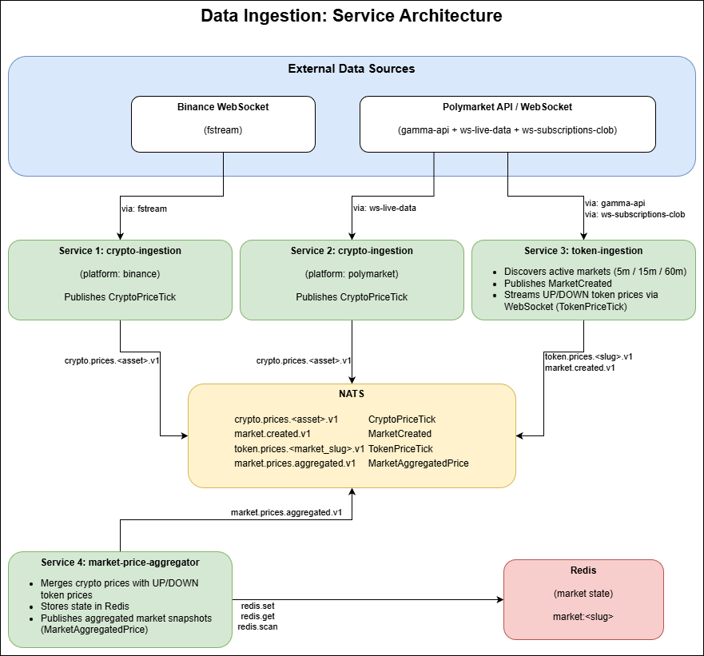

# Data Ingestion

A Go event-driven data ingestion layer that streams cryptocurrency prices and prediction market data via [NATS](https://nats.io/) using [Protocol Buffers](https://protobuf.dev/).

## Purpose

This project connects to external data sources (Binance and Polymarket) to:

1. **Track real-time crypto prices** — streams live BTC, ETH and other asset prices as price-tick events on NATS.
2. **Discover prediction markets** — scans Polymarket for active bet markets matched to tracked crypto assets and configurable timeframes (5 min, 15 min, 60 min).
3. **Stream bet-token prices** — publishes real-time UP/DOWN token prices for each active market.
4. **Aggregate market snapshots** — combines crypto prices with bet-token prices into a single enriched event per market.

Any downstream service can subscribe to NATS topics and consume the Protobuf messages using the schema defined in this repo.

---

## Architecture



---

## Services

### 1. `crypto-ingestion` — Crypto Price Streamer

Connects to a price feed (Binance or Polymarket) and publishes live cryptocurrency prices to NATS.

- **Run one instance per platform** — Binance and Polymarket run as separate containers.
- **WebSocket with exponential backoff** — automatically reconnects on failure.
- **Filters zero prices** — only valid ticks are published.

**Key env vars:**

| Variable | Description | Example |
|---|---|---|
| `INGESTION_PLATFORM` | Data source platform | `binance` or `polymarket` |
| `CRYPTO_SYMBOLS` | Symbols to track (`min:full:convert`) | `btc:bitcoin:usdc,eth:ethereum:usdc` |
| `NATS_SUBJECT_CRYPTO_PRICE_TEMPLATE` | NATS subject pattern | `prices.crypto.%s.v1` |

---

### 2. `token-ingestion` — Market Discovery & Token Price Streamer

Periodically discovers active Polymarket prediction markets and streams UP/DOWN token prices for each.

- **Discovery loop** — polls Polymarket's API at a configurable interval.
- **Timeframe filters** — 5-minute, 15-minute, and 60-minute markets.
- **Asset matching** — only markets for tracked crypto assets are considered.
- **Market lifecycle** — prunes expired markets automatically.
- **Dynamic subscriptions** — subscribes/unsubscribes from token price streams as markets open and close.

**Key env vars:**

| Variable | Description | Example |
|---|---|---|
| `TOKEN_MARKET_DISCOVERY_INTERVAL_SECONDS` | How often to scan for new markets | `10` |
| `TOKEN_MARKET_TYPES` | Timeframe windows (minutes) | `5,15,60` |
| `NATS_SUBJECT_MARKET_CREATED` | Subject for new-market events | `markets.created.v1` |
| `NATS_SUBJECT_BET_TOKEN_PRICE_TEMPLATE` | Subject pattern for token prices | `prices.bet-token.%s.v1` |

---

### 3. `market-price-aggregator` — Aggregated Market Snapshot Publisher

Listens to crypto and token price events and merges them into a single enriched snapshot per market.

- **Subscribes to** three NATS topics: `market.discovered`, `prices.crypto.*`, `prices.bet-token.*`.
- **State stored in Redis** — each market's latest prices are persisted.
- **Publishes** a unified `MarketAggregatedPrice` event whenever a crypto or token price update arrives.
- **Uses shared ProtoPublisher** — reuses the same NATS publisher infrastructure for consistency.

**Key env vars:**

| Variable | Description | Default | Example |
|---|---|---|---|
| `REDIS_URL` | Redis connection string | `redis://localhost:6379` | `redis://localhost:6379` |
| `NATS_URL` | NATS server URL | `nats://localhost:4222` | `nats://localhost:4222` |
| `NATS_SUBJECT_MARKET_AGGREGATED_PRICE` | Subject for aggregated market prices | `market.prices.aggregated.v1` | `market.prices.aggregated.v1` |
| `NATS_SUBJECT_MARKET_DISCOVERED` | Subject to listen for market discovery | `markets.discovered.v1` | `markets.discovered.v1` |
| `NATS_SUBJECT_CRYPTO_PRICE_PATTERN` | Pattern to subscribe to crypto prices | `prices.crypto.*.v1` | `prices.crypto.*.v1` |
| `NATS_SUBJECT_TOKEN_PRICE_PATTERN` | Pattern to subscribe to token prices | `prices.bet-token.*.v1` | `prices.bet-token.*.v1` |

---

## NATS Topics

| Subject | Direction | Message Type | Description |
|---|---|---|---|
| `prices.crypto.<asset>.v1` | Published | `CryptoPriceTick` | Live price tick for a tracked crypto asset (e.g. `prices.crypto.btc.v1`) |
| `markets.created.v1` | Published | `MarketCreated` | A new prediction market was discovered |
| `markets.discovered.v1` | Internal | `MarketDiscovered` | Internal signal used by the aggregator to track a new market |
| `prices.bet-token.<market_slug>.v1` | Published | `TokenPriceTick` | Live UP/DOWN token price for an active market |
| `market.prices.aggregated.v1` | Published | `MarketAggregatedPrice` | Aggregated snapshot: crypto price + UP/DOWN token prices (subject configurable via `NATS_SUBJECT_MARKET_AGGREGATED_PRICE`) |

---

## Protocol Buffers

All messages are serialized with Protocol Buffers. The schema lives at [`app/internal/proto/messages.proto`](app/internal/proto/messages.proto).

```protobuf
syntax = "proto3";

package ingestion;

// Published to: prices.crypto.<asset>.v1
// Live cryptocurrency price tick from an exchange or data provider.
message CryptoPriceTick {
  string source            = 1; // "binance" | "polymarket"
  string symbol            = 2; // e.g. "btc"
  double price             = 3;
  int64  timestamp_unix_ms = 4;
}

// Published to: prices.bet-token.<market_slug>.v1
// Price tick for a single UP or DOWN prediction-market token.
message TokenPriceTick {
  string source            = 1; // "polymarket"
  string market_id         = 2;
  string condition_id      = 3;
  string token_id          = 4;
  string side              = 5; // "UP" | "DOWN"
  double price             = 6;
  int64  timestamp_unix_ms = 7;
}

// Published to: markets.created.v1
// Fired when a new prediction market is discovered.
message MarketCreated {
  string source                = 1; // "polymarket"
  string market_id             = 2;
  string condition_id          = 3;
  string crypto_symbol         = 4; // e.g. "btc"
  int32  timeframe_minutes     = 5; // 5 | 15 | 60
  string up_token_id           = 6;
  string down_token_id         = 7;
  int64  start_unix_ms         = 8;
  int64  end_unix_ms           = 9;
  int64  discovered_at_unix_ms = 10;
  bool   closed                = 11;
}

// Internal command used by market-price-aggregator to track/untrack markets.
message MarketTrackCommand {
  string action        = 1; // "UPSERT" | "REMOVE"
  string market_id     = 2;
  string up_token_id   = 3;
  string down_token_id = 4;
}

// Internal signal published by token-ingestion; consumed by market-price-aggregator.
message MarketDiscovered {
  string market_id             = 1;
  string crypto_symbol         = 2;
  string up_token_id           = 3;
  string down_token_id         = 4;
  int64  discovered_at_unix_ms = 5;
}

// Published to: prices.market.<market_slug>.v1
// Aggregated snapshot combining the current crypto price with UP/DOWN token prices.
message MarketAggregatedPrice {
  string market_id         = 1;
  string crypto_symbol     = 2;
  double crypto_price      = 3;
  string up_token_id       = 4;
  double up_token_price    = 5;
  string down_token_id     = 6;
  double down_token_price  = 7;
  int64  timestamp_unix_ms = 8;
  string last_updated_by   = 9; // "crypto" | "token"
}
```

---

## Running Locally

### Prerequisites

- [Go 1.22+](https://go.dev/dl/)
- [Docker](https://www.docker.com/) & Docker Compose
- A `.env` file (copy from `.env.example`)

### With Docker Compose (recommended)

```bash
cp .env.example .env
cd infra/docker
./compose-up.sh
./compose-up.sh -d
```

This starts all services plus NATS and Redis.

### WSL / Architecture (GOARCH)

Use the helper scripts in `infra/docker` (they detect architecture via `uname -m` and set `TARGETARCH` automatically):

```bash
cd infra/docker
./compose-up.sh
```

To only build images:

```bash
cd infra/docker
./compose-build.sh
```

If you prefer running Docker Compose directly (advanced usage), you can still force architecture manually:

```bash
# Force AMD64 (x86_64)
TARGETARCH=amd64 docker compose up --build

# Force ARM64
TARGETARCH=arm64 docker compose up --build
```

Quick architecture check (troubleshooting):

```bash
# Host (WSL/Linux)
uname -m

# Inside a running service container
docker compose exec crypto-ingestion-binance uname -m
```

Common outputs:

- `x86_64` => use `TARGETARCH=amd64`
- `aarch64` or `arm64` => use `TARGETARCH=arm64`

### Running Individual Services

```bash
cd app
go mod tidy

# Crypto ingestion — Binance
INGESTION_PLATFORM=binance go run ./cmd/crypto-ingestion

# Crypto ingestion — Polymarket
INGESTION_PLATFORM=polymarket CRYPTO_SYMBOLS=btc:bitcoin:usdc,eth:ethereum:usdc go run ./cmd/crypto-ingestion

# Token ingestion
TOKEN_MARKET_TYPES=5,15,60 go run ./cmd/token-ingestion

# Market price aggregator
REDIS_URL=redis://localhost:6379 go run ./cmd/market-price-aggregator
```

---

## Configuration Reference

Copy `.env.example` to `.env` and adjust the values for your environment.

| Variable | Default | Description |
|---|---|---|
| `NATS_URL` | `nats://localhost:4222` | NATS server connection URL |
| `INGESTION_PLATFORM` | `polymarket` | Price feed platform (`binance` \| `polymarket`) |
| `CRYPTO_SYMBOLS` | `btc:bitcoin:usdc,eth:ethereum:usdc` | Assets to track (`min:full:convert_to`) |
| `TOKEN_MARKET_DISCOVERY_INTERVAL_SECONDS` | `10` | Market discovery poll interval (seconds) |
| `TOKEN_MARKET_TYPES` | `5,15,60` | Bet-market timeframes to watch (minutes) |
| `REDIS_URL` | `redis://localhost:6379` | Redis connection URL (aggregator) |
| `WEBSOCKET_RETRY_INITIAL_DELAY` | `500ms` | Initial backoff delay for WebSocket reconnect |
| `WEBSOCKET_RETRY_MAX_DELAY` | `20s` | Maximum backoff delay for WebSocket reconnect |
| `HTTP_RETRY_MAX_ATTEMPTS` | `8` | Maximum HTTP retry attempts |
